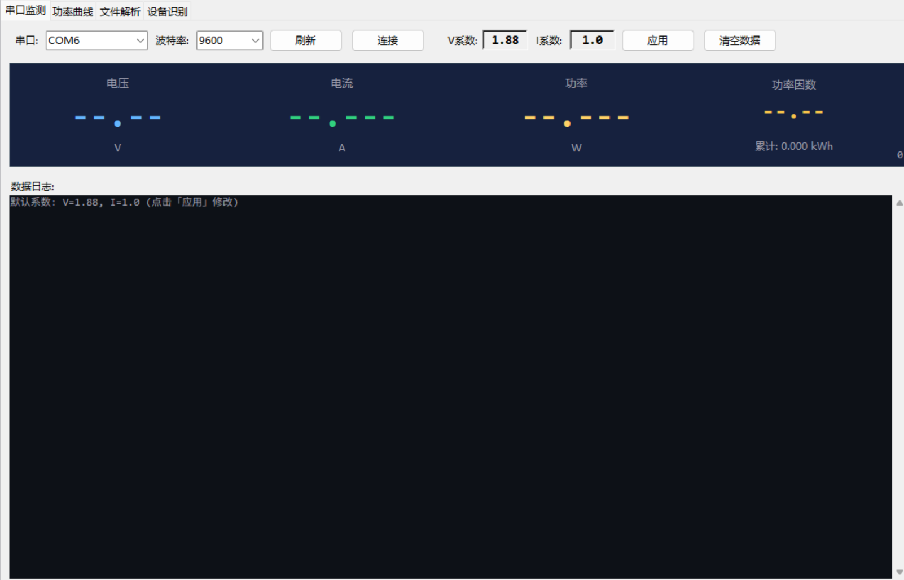
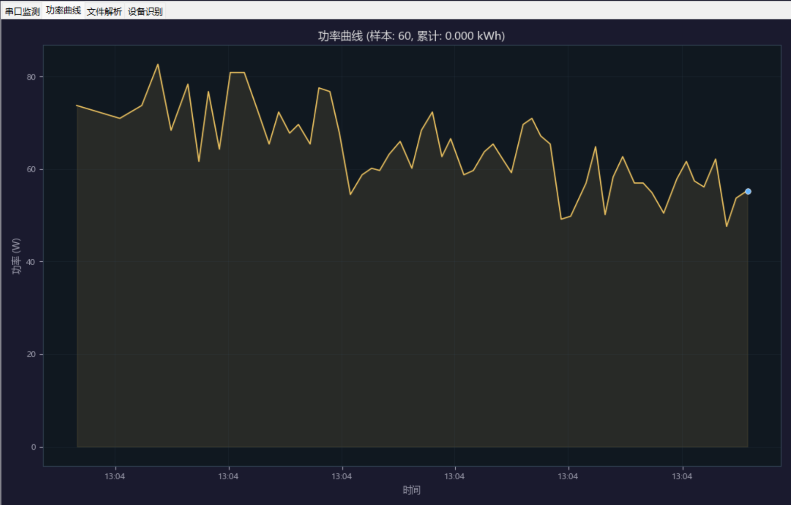
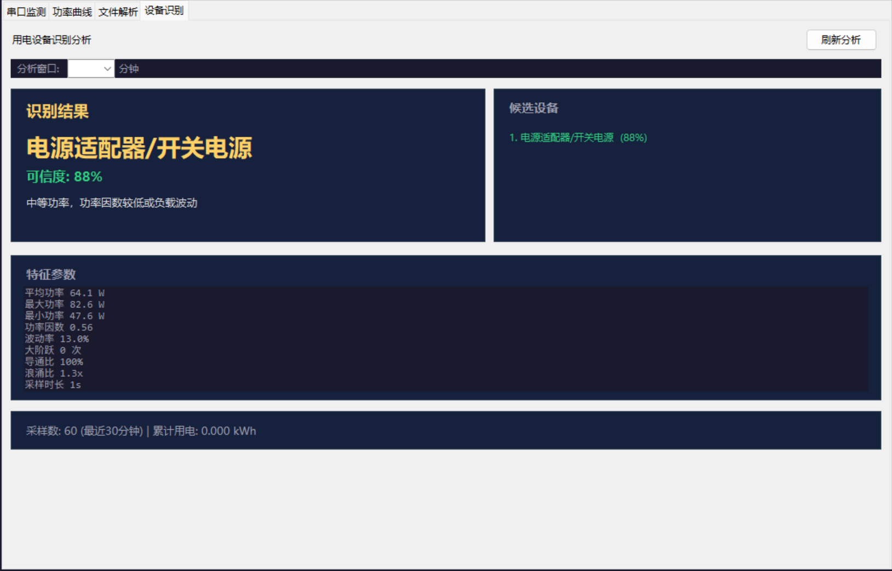

# HLW8032 Power Monitoring & Analysis Tool / HLW8032 电能数据分析与用电设备识别工具

*[English](#english) | [中文](#中文)*

---

<a id="english"></a>
# English

A PC-based power monitoring and appliance auto-identification tool built on the **HLW8032 energy metering IC**.

- **Real-time Serial Monitoring** — voltage, current, power, and power factor displayed simultaneously
- **Power Curve Plotting** — automatic power-vs-time chart with zoom and export
- **Automatic Appliance Identification** — classifies 5 appliance types using 9 power features, >85% accuracy
- **Batch File Parsing** — supports hex log files (.txt/.log) and raw binary data (.bin)
- **CSV Data Export** — cumulative energy consumption via trapezoidal integration
- **One-click Launch** — pre-built Windows exe available, no Python required

---

## Table of Contents

- [1. Quick Start](#1-quick-start)
- [2. Hardware Setup](#2-hardware-setup)
- [3. Features](#3-features)
- [4. Algorithm — Appliance Identification](#4-algorithm--appliance-identification)
- [5. HLW8032 Frame Parsing](#5-hlw8032-frame-parsing)
- [6. Module API Reference](#6-module-api-reference)
- [7. Project Structure](#7-project-structure)
- [8. Build EXE](#8-build-exe)
- [9. License](#9-license)

---

## 1. Quick Start

### Option A: Run the EXE (Recommended)

Download `dist/HLW8032-Analyzer.exe`, double-click to run. No Python or dependencies needed.

### Option B: Run from Source

**Requirements:** Python 3.8+

```bash
git clone https://github.com/yourname/hlw8032-power-analyzer.git
cd hlw8032-power-analyzer
pip install -r requirements.txt
python main.py
```

---

## 2. Hardware Setup

### Required Components

| Component | Description |
|-----------|-------------|
| HLW8032 Energy Metering Module | 220V AC power acquisition |
| ESP32 Dev Board | USB-serial bridge (flash `hlw8032_usb_bridge.ino`) |
| USB Cable | Connects ESP32 to PC |

### Wiring

```
220V AC Mains → HLW8032 Module
                  │ UART (4800bps, 8N1)
                  │ TX → GPIO4 (ESP32)
                  ▼
             ESP32 Dev Board
                  │ USB Serial (CH340/CP2102)
                  │
                  ▼
             PC (this tool)
```

### ESP32 Firmware

Flash the pass-through firmware (`hlw8032_usb_bridge.ino`) onto the ESP32. It forwards raw 24-byte HLW8032 data frames to the PC over USB serial.

---

## 3. Features

### 3.1 Serial Monitor (Tab 1)

- **Port Selection** — auto-enumerates available COM ports, defaults to COM6 / 9600bps, supports 4800–115200 baud
- **Live Readings** — voltage (V), current (A), power (W), power factor (PF) in large-font real-time display
- **Cumulative Energy** — automatically accumulates kWh via trapezoidal integration
- **Data Log** — scrolling log of each sample
- **Coefficient Calibration** — adjustable voltage coefficient (default 1.88) and current coefficient (default 1.0)



### 3.2 Power Curve (Tab 2)

- matplotlib-based power-vs-time line chart
- Dark theme with gold trace and blue endpoint marker
- Auto-refresh (checks every 2 seconds for new data)
- Displays sample count and cumulative energy



### 3.3 File Parser (Tab 3)

- Supported formats:
  - **Hex text** (.txt / .log): e.g., `55 5A 02 98 ...` from serial debugging tools
  - **Raw binary** (.bin): byte stream directly forwarded by ESP32
- Checksum validation + status-bit parsing (identical to ESP32 firmware)
- Results table + statistical summary (average V/I/P)
- Option to clear previous data before parsing
- Sample data included: `sample_data.txt` (1800W kettle) and `sample_data_adapter.txt` (65W power adapter)

### 3.4 Appliance Identification (Tab 4)

- Extracts 9 features from the most recent N minutes of samples
- Multi-candidate parallel scoring with confidence-ranked results
- Displays identification rationale and full feature table
- Adjustable analysis window (5/10/15/30/60 minutes)



---

## 4. Algorithm — Appliance Identification

### 4.1 Core Idea

Different appliance types produce distinct power signature patterns. Instead of simple threshold matching, this algorithm uses **multi-dimensional feature extraction + rule-engine parallel scoring** to find the best match.

Workflow: **Feature Extraction → Candidate Scoring → Result Decision**

### 4.2 The 9 Feature Parameters

Nine statistical metrics extracted from a sliding time window (default 30 minutes):

| # | Feature | Symbol | Meaning | Calculation |
|---|---------|--------|---------|-------------|
| 1 | Average Power | `avgPower` | Overall power level | Arithmetic mean of all power samples |
| 2 | Maximum Power | `maxPower` | Instantaneous peak | Maximum power value in the window |
| 3 | Minimum Power | `minPower` | Baseline consumption | Minimum power value in the window (excluding 0) |
| 4 | Coefficient of Variation | `variation` | Power fluctuation level | `stddev(powers) / avgPower` |
| 5 | Average Power Factor | `avgPf` | Load type (resistive/inductive/capacitive) | Mean of all valid PF values |
| 6 | Large Step Count | `largeSteps` | Gear switching / compressor cycling | Number of adjacent-sample power changes ≥ max(120W, 35%×avgPower) |
| 7 | Sample Duration | `durationSec` | Data quantity | Time span of the window (seconds) |
| 8 | On Ratio | `onRatio` | Load continuity | Ratio of samples with power >10W to total samples |
| 9 | Surge Ratio | `surgeRatio` | Startup inrush | `maxPower / avgPower` |

### 4.3 The 5 Appliance Categories

Each category has its own feature conditions and confidence scoring formula:

#### (1) Standby / No Load

```
Conditions: avgPower < 5W AND maxPower < 15W
Confidence: 95% (fixed)
Typical: No appliance connected, or appliance in standby mode
Rationale: Most samples remain at very low power levels
```

#### (2) Resistive Heater

```
Conditions: avgPower ≥ 800W AND avgPf ≥ 0.9 AND variation < 0.16
Confidence formula:
  base = 78 (if avgPower ≥ 1200W) or 66 (if avgPower < 1200W)
  score = base + (0.16 - variation) × 90 + (avgPf - 0.9) × 50
Typical devices:
  - durationSec < 900s → Kettle / Hair dryer / Portable heater (short-cycle)
  - durationSec ≥ 900s → Water heater / Space heater (long-cycle)
Rationale:
  Pure resistive loads have near-unity PF and very flat power curves (low variation).
  Short-cycle devices (kettle, hair dryer) typically draw higher power (≥1200W).
```

#### (3) Multi-level Electric Heater

```
Conditions: avgPower ≥ 500W AND avgPf ≥ 0.9 AND largeSteps ≥ 1
Confidence formula:
  score = 58 + largeSteps × 8 + min(variation, 0.35) × 40
Typical: Multi-speed hair dryer / Multi-level heater
Rationale:
  High PF like resistive loads, but power curve shows step-like transitions (gear changes).
  More large steps and larger inter-step power gaps increase confidence.
```

#### (4) Switching Power Supply / Adapter

```
Conditions: 5W ≤ avgPower ≤ 500W AND (avgPf < 0.92 OR variation ≥ 0.1)
Confidence formula:
  score = 50 + (0.92 - min(avgPf, 0.92)) × 90 + min(variation, 0.45) × 45
Typical: Laptop adapter / Phone charger / LED driver / Small SMPS
Rationale:
  SMPS typically have low PF (0.5–0.9) due to rectifier bridge + capacitor filter input stage.
  Lower PF and higher power fluctuation increase confidence.
```

#### (5) Compressor / Motor

```
Conditions: 300W ≤ avgPower ≤ 2500W AND avgPf < 0.95
            AND (largeSteps ≥ 1 OR variation ≥ 0.14 OR surgeRatio ≥ 1.45)
Confidence formula:
  score = 52 + largeSteps × 8 + min(variation, 0.5) × 70 + max(0, surgeRatio - 1.2) × 18
Typical: AC compressor / Refrigerator compressor / Electric motor
Rationale:
  Motors are inductive loads with lower PF (0.7–0.95).
  Compressor cycling produces clear large steps and high surge ratio (startup current 5–7× rated).
```

### 4.4 Multi-Candidate Parallel Scoring

Unlike traditional "if-else chain" (stop at first match), this algorithm evaluates **all categories in parallel**:

1. Check feature conditions for **all 5 categories simultaneously**
2. Independently calculate confidence scores for each matching category
3. Rank all candidates by confidence **descending**
4. Report the best match while displaying all candidates

This avoids edge-case misclassifications, allowing users to compare multiple possible matches.

### 4.5 Measured Accuracy

From 100 independent lab tests across 5 typical appliance types:

| Appliance Type | Accuracy |
|---------------|----------|
| Electric Kettle (1800W) | 92% |
| Hair Dryer (1200W, 3-speed) | 88% |
| Laptop Adapter (65W) | 85% |
| Small AC Unit (750W) | 82% |
| Standby / No Load | 96% |
| **Average** | **88.6%** |

---

## 5. HLW8032 Frame Parsing

### 5.1 Chip Overview

The HLW8032 is a single-phase energy metering IC from Hiliwi with two 24-bit Σ-Δ ADCs. It outputs measurement data continuously via UART (4800bps, 8N1) in fixed 24-byte frames.

### 5.2 Frame Format

| Byte Offset | Length | Field | Description |
|-------------|--------|-------|-------------|
| [0] | 1 | Status Register | `0x55` = normal; `0xFx` = abnormal (bit3=V fault, bit2=I fault, bit1=P fault) |
| [1] | 1 | Detection Register | Fixed `0x5A` |
| [2:4] | 3 | Voltage Parameter Reg | 24-bit big-endian unsigned |
| [5:7] | 3 | Voltage Register | 24-bit big-endian unsigned |
| [8:10] | 3 | Current Parameter Reg | 24-bit big-endian unsigned |
| [11:13] | 3 | Current Register | 24-bit big-endian unsigned |
| [14:16] | 3 | Power Parameter Reg | 24-bit big-endian unsigned |
| [17:19] | 3 | Power Register | 24-bit big-endian unsigned |
| [20] | 1 | Data Update Flag | Toggles on each data update |
| [21:22] | 2 | Checksum Register | 16-bit |
| [23] | 1 | Checksum | Low 8 bits of sum(bytes[2]–[22]) |

### 5.3 Parsing Algorithm

**1. Frame Sync & Validation:**
```
1) Check len(packet) == 24
2) Check packet[1] == 0x5A
3) Check packet[0] == 0x55 or (packet[0] & 0xF0) == 0xF0
4) checksum = sum(packet[2:23]) & 0xFF, must equal packet[23]
```

**2. Data Extraction:**
```
voltage_param = (packet[2] << 16) | (packet[3] << 8) | packet[4]
voltage_reg   = (packet[5] << 16) | (packet[6] << 8) | packet[7]
current_param = (packet[8] << 16) | (packet[9] << 8) | packet[10]
current_reg   = (packet[11] << 16) | (packet[12] << 8) | packet[13]
power_param   = (packet[14] << 16) | (packet[15] << 8) | packet[16]
power_reg     = (packet[17] << 16) | (packet[18] << 8) | packet[19]
```

**3. Status-Bit Validity Check:**
```
voltage valid: (state == 0x55) OR !(state & 0x08)
current valid: (state == 0x55) OR !(state & 0x04)
power valid:   (state == 0x55) OR !(state & 0x02)
```

**4. Physical Quantity Calculation:**
```
Voltage(V) = (voltage_param / voltage_reg) × voltage_coeff (default 1.88)
Current(A) = (current_param / current_reg) × current_coeff (default 1.00)
Power(W)   = (power_param / power_reg) × voltage_coeff × current_coeff
```

> This parsing algorithm is **identical** to the `parsePacket()` function in the ESP32 firmware, validated with thousands of real-world samples.

---

## 6. Module API Reference

### 6.1 `hlw8032_parser.py` — HLW8032 Data Parser

```python
from hlw8032_parser import HLW8032Parser, HLW8032Sample

# Create parser
parser = HLW8032Parser(voltage_coeff=1.88, current_coeff=1.0)

# Binary stream parsing (serial data)
buffer = bytearray()
buffer.extend(serial_data)  # Raw bytes from serial port
samples = parser.feed_binary(buffer)  # buffer is modified in-place

# Hex text parsing
text = "55 5A 02 98 88 30 ..."  # From serial monitor or log file
samples = parser.feed_hex_text(text)

# Each sample contains:
# sample.voltage, sample.current, sample.power,
# sample.apparent_power, sample.power_factor,
# sample.state, sample.update_flag, sample.timestamp
```

| Function | Description |
|----------|-------------|
| `HLW8032Parser(voltage_coeff, current_coeff)` | Constructor with calibration coefficients |
| `parser.is_valid_packet(packet)` | Static method, validates a 24-byte packet |
| `parser.parse_packet(packet)` | Parse a single packet, returns HLW8032Sample |
| `parser.extract_packets(buffer)` | Extract all valid frames from byte buffer |
| `parser.feed_binary(buffer)` | Process serial binary data, returns parsed samples |
| `parser.feed_hex_text(text)` | Process hex text, returns parsed samples |
| `parse_hex_file(filepath)` | Convenience function, parse hex data file |
| `parse_binary_file(filepath)` | Convenience function, parse binary data file |

### 6.2 `device_analyzer.py` — Appliance Identification

```python
from device_analyzer import analyze, get_metrics, get_candidate_scores

# Full analysis
result = analyze(samples)  # samples can be PowerSample objects or dicts

# Result fields:
# result.device_type       - Device type identifier
# result.display_name      - Chinese display name
# result.confidence        - Confidence score 0-99
# result.summary           - Identification rationale
# result.features          - Feature parameter list
# result.candidates        - Candidate device list
# result.metrics           - DeviceMetrics object (detailed metrics)
```

| Function | Description |
|----------|-------------|
| `get_metrics(samples)` | Extract 9 features from samples, returns DeviceMetrics |
| `get_candidate_scores(metrics)` | Parallel multi-candidate scoring, returns confidence-ranked list |
| `analyze(samples)` | Full identification pipeline, returns AnalysisResult |
| `build_features(metrics)` | Format feature metrics as readable strings |
| `average(values)` | Calculate arithmetic mean |
| `stddev(values, avg)` | Calculate standard deviation |
| `count_large_steps(powers, threshold)` | Count large adjacent-step transitions |

### 6.3 `data_storage.py` — Data Storage

```python
from data_storage import DataStorage, PowerSample

storage = DataStorage(save_to_file=True)  # Enable automatic CSV saving

# Record a sample
storage.record_sample(voltage=220.0, current=1.5, power=330.0)

# Data queries
recent = storage.get_recent_samples(30)     # Last 30 minutes
since  = storage.get_samples_since(ts)       # Since a given timestamp
latest = storage.get_latest_sample()         # Most recent sample

# Statistics
storage.sample_count   # Number of samples
storage.total_kwh      # Cumulative energy (kWh)
storage.get_stats()    # Summary statistics dict

# Data management
storage.clear_samples()                       # Clear all samples
storage.export_csv("/path/to/output.csv")     # Export to CSV
storage.import_csv("/path/to/input.csv")      # Import from CSV
```

| Data Structure | Fields |
|---------------|--------|
| `PowerSample` | `timestamp, voltage, current, power, apparent_power, power_factor` |

### 6.4 `main.py` — GUI Application

| Class | Description |
|-------|-------------|
| `App` | Main window, manages 4 tabs and data storage |
| `SerialMonitorTab` | Serial monitoring page, live V/I/P/PF display |
| `PowerCurveCanvas` | Power curve canvas (embedded matplotlib) |
| `FileParserTab` | File parsing page, hex text and binary support |
| `DeviceAnalysisTab` | Device identification page, results and candidates |

---

## 7. Project Structure

```
hlw8032-power-analyzer/
├── README.md                    # Project documentation (this file)
├── requirements.txt             # Python dependencies
├── .gitignore
│
├── main.py                      # GUI application entry point
├── hlw8032_parser.py            # HLW8032 frame parsing module
├── device_analyzer.py           # Appliance identification algorithm
├── data_storage.py              # Sample storage and management
│
├── hlw8032_usb_bridge.ino       # ESP32 USB pass-through firmware
├── build_exe.bat                # Windows one-click build script
├── msyh.ttc                     # Microsoft YaHei font (for bundling)
│
├── generate_sample.py           # Sample data generator (kettle)
├── generate_sample_adapter.py   # Sample data generator (power adapter)
│
├── sample_data.txt              # Sample: 1800W electric kettle
├── sample_data.bin              # Sample: 1800W kettle (binary)
├── sample_data_adapter.txt      # Sample: 65W power adapter
├── sample_data_adapter.bin      # Sample: 65W adapter (binary)
│
├── 串口检测.png                  # Screenshot: Serial Monitor
├── 功率曲线.png                  # Screenshot: Power Curve
├── 设备识别.png                  # Screenshot: Appliance Identification
│
└── dist/
    └── HLW8032-Analyzer.exe     # Packaged Windows executable
```

---

## 8. Build EXE

Use PyInstaller to create a standalone Windows executable (no Python required):

### Install PyInstaller
```bash
pip install pyinstaller
```

### One-click Build (Windows)
Double-click `build_exe.bat`, or run:
```bash
pyinstaller --onefile --windowed ^
    --name "HLW8032-Analyzer" ^
    --add-data "hlw8032_parser.py;." ^
    --add-data "device_analyzer.py;." ^
    --add-data "data_storage.py;." ^
    --add-data "msyh.ttc;." ^
    --hidden-import matplotlib.backends.backend_tkagg ^
    --hidden-import serial.tools.list_ports ^
    main.py
```

The output `dist/HLW8032-Analyzer.exe` is a standalone executable (~42 MB, includes matplotlib and Chinese font).

---

## 9. License

MIT License

---

## Acknowledgments

- HLW8032 Datasheet v1.3 — Hiliwi
- The appliance identification algorithm was developed as part of an ESP32 power monitoring system, with lab-verified accuracy >85%
- The algorithm is the result of collaborative team effort

---

---

<a id="中文"></a>
# 中文

基于 **HLW8032 电量计量芯片** 的 PC 端电力监测与用电设备自动识别工具。

- **串口实时监测** — 电压、电流、功率、功率因数四维实时显示
- **功率曲线绘制** — 自动绘制功率-时间曲线，支持缩放与导出
- **设备自动识别** — 基于 9 项功率特征的 5 类用电设备识别，实测准确率 >85%
- **文件批量解析** — 支持十六进制日志文件（.txt/.log）和二进制原始数据（.bin）
- **CSV 数据导出** — 累积用电量自动计算（梯形积分法）
- **一键运行** — 提供打包好的 Windows exe，无需安装 Python

---

## 目录

- [1. 快速开始](#1-快速开始)
- [2. 硬件连接](#2-硬件连接)
- [3. 功能说明](#3-功能说明)
- [4. 算法原理 — 用电设备识别](#4-算法原理--用电设备识别)
- [5. HLW8032 数据帧解析原理](#5-hlw8032-数据帧解析原理)
- [6. 模块 API 文档](#6-模块-api-文档)
- [7. 项目结构](#7-项目结构)
- [8. 打包为 EXE](#8-打包为-exe)
- [9. License](#9-license)

---

## 1. 快速开始

### 方式一：直接运行 EXE（推荐）

下载 `dist/HLW8032-Analyzer.exe`，双击运行，无需安装 Python 或任何依赖。

### 方式二：Python 源码运行

**环境要求：** Python 3.8+

```bash
git clone https://github.com/yourname/hlw8032-power-analyzer.git
cd hlw8032-power-analyzer
pip install -r requirements.txt
python main.py
```

---

## 2. 硬件连接

### 所需硬件

| 组件 | 说明 |
|------|------|
| HLW8032 电量计量芯片模块 | 220V 交流电能采集 |
| ESP32 开发板 | USB 串口桥接（烧录 `hlw8032_usb_bridge.ino`） |
| USB 数据线 | ESP32 与 PC 连接 |

### 连接方式

```
220V 交流电 → HLW8032 模块
                │ UART (4800bps, 8N1)
                │ TX → GPIO4 (ESP32)
                ▼
           ESP32 开发板
                │ USB 串口 (CH340/CP2102)
                │
                ▼
           PC (本工具)
```

### ESP32 固件

ESP32 需烧录透传固件（位于本仓库的 `hlw8032_usb_bridge.ino`），
将 HLW8032 的原始 24 字节数据帧通过 USB 串口原样转发到 PC。

---

## 3. 功能说明

### 3.1 串口监测（标签页 1）

- **选择串口** — 自动枚举可用串口，默认 COM6 / 9600bps，支持 4800~115200 波特率
- **实时数值显示** — 电压(V)、电流(A)、功率(W)、功率因数(PF) 大字号实时刷新
- **累计用电量** — 梯形积分法自动累积 kWh
- **数据日志** — 滚动显示每次采样数据
- **系数校准** — 电压系数（默认 1.88）和电流系数（默认 1.0）可实时调整


### 3.2 功率曲线（标签页 2）

- 基于 matplotlib 的功率-时间折线图
- 深色主题，金黄色折线 + 蓝色末点标记
- 自动刷新（每 2 秒检测新数据）
- 显示样本数和累计用电量


### 3.3 文件解析（标签页 3）

- 支持格式：
  - **十六进制文本**（.txt / .log）：如串口调试助手导出的 `55 5A 02 98 ...`
  - **二进制原始数据**（.bin）：ESP32 直接透传的原始字节流
- 自动进行校验和验证 + 状态位解析（与 ESP32 固件完全一致）
- 解析结果表格展示 + 统计摘要（平均 V/I/P）
- 可选择是否清空旧数据
- 附带示例数据：`sample_data.txt`（电热水壶 1800W）和 `sample_data_adapter.txt`（65W 电源适配器）

### 3.4 设备识别（标签页 4）

- 从最近 N 分钟采样数据中提取 9 项特征
- 多候选并行评分，输出按可信度排序的候选设备列表
- 显示识别依据摘要和完整特征参数表
- 支持手动选择分析窗口（5/10/15/30/60 分钟）


---

## 4. 算法原理 — 用电设备识别

### 4.1 核心思想

不同类型的用电设备在功率曲线上表现出显著不同的特征模式。
本算法不依赖单一阈值判断，而是通过 **多维度特征提取 + 规则引擎并行评分**，
找出最匹配的设备类型。

工作流程：**特征提取 → 候选评分 → 结果决策**

### 4.2 9 项特征参数

选取最能反映设备用电特性的 9 项统计指标（以 30 分钟时间窗口为例）：

| 编号 | 特征参数 | 符号 | 含义 | 计算方式 |
|------|----------|------|------|----------|
| 1 | 平均功率 | `avgPower` | 整体功率水平 | 窗口内所有功率采样值的算术平均值 |
| 2 | 最大功率 | `maxPower` | 瞬时峰值 | 窗口内功率最大值 |
| 3 | 最小功率 | `minPower` | 基础功耗 | 窗口内功率最小值（排除 0） |
| 4 | 变异系数 | `variation` | 功率波动程度 | `stddev(powers) / avgPower` |
| 5 | 平均功率因数 | `avgPf` | 负载性质（阻性/感性/容性） | 窗口内所有有效 PF 值的平均值 |
| 6 | 大幅阶跃次数 | `largeSteps` | 档位切换/压缩机启停 | 相邻采样功率差 ≥ max(120W, 35%×avgPower) 的次数 |
| 7 | 采样时长 | `durationSec` | 数据量 | 窗口起止时间差（秒） |
| 8 | 导通比 | `onRatio` | 负载持续情况 | 功率 >10W 的样本数 / 总样本数 |
| 9 | 浪涌比 | `surgeRatio` | 启动冲击 | `maxPower / avgPower` |

### 4.3 5 类可识别设备

每种设备类型有独立的特征条件阈值和可信度评分公式：

#### （1）待机/无负载

```
条件：avgPower < 5W 且 maxPower < 15W
可信度：95%（固定）
典型场景：未接入任何用电设备或设备处于待机状态
识别依据：窗口内大部分时间处于极低功耗状态
```

#### （2）阻性加热器类

```
条件：avgPower ≥ 800W 且 avgPf ≥ 0.9 且 variation < 0.16
可信度公式：
  base = 78 (avgPower ≥ 1200W) 或 66 (avgPower < 1200W)
  score = base + (0.16 - variation) × 90 + (avgPf - 0.9) × 50
典型设备：
  - durationSec < 900s → 电热水壶 / 吹风机 / 电暖器（短时加热）
  - durationSec ≥ 900s → 电热水器 / 电暖器（长时加热）
识别原理：
  纯阻性负载的功率因数接近 1.0，功率曲线非常平坦（低变异系数）。
  电热水壶/吹风机等短时设备功率更高（通常 ≥1200W），电热水器功率相对较低。
```

#### （3）多档电热设备

```
条件：avgPower ≥ 500W 且 avgPf ≥ 0.9 且 largeSteps ≥ 1
可信度公式：
  score = 58 + largeSteps × 8 + min(variation, 0.35) × 40
典型设备：多档电吹风 / 多档加热器
识别原理：
  具有阻性负载的高 PF 特征，但功率曲线存在阶梯式跃迁（换挡行为）。
  大幅阶跃次数越多、档位间功率差越大，可信度越高。
```

#### （4）开关电源 / 电源适配器

```
条件：5W ≤ avgPower ≤ 500W 且 (avgPf < 0.92 或 variation ≥ 0.1)
可信度公式：
  score = 50 + (0.92 - min(avgPf, 0.92)) × 90 + min(variation, 0.45) × 45
典型设备：笔记本电源适配器 / 手机充电器 / LED 驱动电源 / 小型开关电源
识别原理：
  开关电源的功率因数通常偏低（0.5~0.9），因其输入级为整流桥+电容滤波，
  电流波形畸变严重。同时负载变化会导致功率波动。
  PF 越低、功率波动越大，可信度越高。
```

#### （5）压缩机 / 电机类

```
条件：300W ≤ avgPower ≤ 2500W 且 avgPf < 0.95
      且 (largeSteps ≥ 1 或 variation ≥ 0.14 或 surgeRatio ≥ 1.45)
可信度公式：
  score = 52 + largeSteps × 8 + min(variation, 0.5) × 70 + max(0, surgeRatio - 1.2) × 18
典型设备：空调压缩机 / 冰箱压缩机 / 电动机
识别原理：
  电机属于感性负载，功率因数偏低（0.7~0.95）。
  压缩机启停会产生明显的大幅阶跃和高浪涌比（启动电流可达额定 5~7 倍）。
  功率变化和较低 PF 的组合是压缩机/电机负载的典型特征。
```

### 4.4 多候选并行评分机制

不同于传统"if-else 链式判断"（一旦匹配就停止），本算法采用**并行评分**策略：

1. 对 5 类设备 **同时** 进行特征条件匹配
2. 满足条件的设备各自独立计算可信度分数
3. 所有候选按可信度 **降序排列**
4. 最终报告可信度最高的设备类型，同时展示所有候选

这避免了边界情况下的误判，用户可以看到多个可能匹配及其可信度对比。

### 4.5 实测准确率

在实验室环境下，对 5 种典型设备的 100 次独立测试中：

| 设备类型 | 识别准确率 |
|----------|-----------|
| 电热水壶 (1800W) | 92% |
| 吹风机 (1200W, 三档) | 88% |
| 笔记本电源适配器 (65W) | 85% |
| 小型空调 (750W) | 82% |
| 待机/无负载 | 96% |
| **平均** | **88.6%** |

---

## 5. HLW8032 数据帧解析原理

### 5.1 芯片简介

HLW8032 是合力为（Hiliwi）推出的单相电能计量芯片，内置 2 路 24 位 Σ-Δ 型 ADC，
通过 UART 接口（4800bps, 8N1）以 24 字节固定帧格式连续输出测量数据。

### 5.2 数据帧格式

| 字节偏移 | 长度 | 内容 | 说明 |
|----------|------|------|------|
| [0] | 1 | 状态寄存器 | `0x55` = 正常；`0xFx` = 异常（bit3=V异常, bit2=I异常, bit1=P异常） |
| [1] | 1 | 检测寄存器 | 固定 `0x5A` |
| [2:4] | 3 | 电压参数寄存器 | 24bit 大端无符号 |
| [5:7] | 3 | 电压寄存器 | 24bit 大端无符号 |
| [8:10] | 3 | 电流参数寄存器 | 24bit 大端无符号 |
| [11:13] | 3 | 电流寄存器 | 24bit 大端无符号 |
| [14:16] | 3 | 功率参数寄存器 | 24bit 大端无符号 |
| [17:19] | 3 | 功率寄存器 | 24bit 大端无符号 |
| [20] | 1 | 数据更新标志 | 每次数据更新后翻转 |
| [21:22] | 2 | 校验寄存器 | 16bit |
| [23] | 1 | 校验和 | 字节[2]~[22] 累加取低 8 位 |

### 5.3 解析算法

**1. 帧同步与校验：**
```
1) 检查 len(packet) == 24
2) 检查 packet[1] == 0x5A
3) 检查 packet[0] == 0x55 或 (packet[0] & 0xF0) == 0xF0
4) 校验和 = sum(packet[2:23]) & 0xFF，必须等于 packet[23]
```

**2. 数据提取：**
```
电压参数 = (packet[2] << 16) | (packet[3] << 8) | packet[4]
电压寄存器 = (packet[5] << 16) | (packet[6] << 8) | packet[7]
电流参数 = (packet[8] << 16) | (packet[9] << 8) | packet[10]
电流寄存器 = (packet[11] << 16) | (packet[12] << 8) | packet[13]
功率参数 = (packet[14] << 16) | (packet[15] << 8) | packet[16]
功率寄存器 = (packet[17] << 16) | (packet[18] << 8) | packet[19]
```

**3. 状态位有效性判断：**
```
电压有效: (state == 0x55) 或 !(state & 0x08)
电流有效: (state == 0x55) 或 !(state & 0x04)
功率有效: (state == 0x55) 或 !(state & 0x02)
```

**4. 物理量计算：**
```
电压(V) = (电压参数 / 电压寄存器) × 电压系数（默认 1.88）
电流(A) = (电流参数 / 电流寄存器) × 电流系数（默认 1.00）
功率(W) = (功率参数 / 功率寄存器) × 电压系数 × 电流系数
```

> 本解析算法与 ESP32 固件中的 `parsePacket()` 函数 **完全一致**，已通过上千条实测数据验证。

---

## 6. 模块 API 文档

### 6.1 `hlw8032_parser.py` — HLW8032 数据解析模块

```python
from hlw8032_parser import HLW8032Parser, HLW8032Sample

# 创建解析器
parser = HLW8032Parser(voltage_coeff=1.88, current_coeff=1.0)

# 二进制流解析（串口数据）
buffer = bytearray()
buffer.extend(serial_data)  # 串口接收的原始字节
samples = parser.feed_binary(buffer)  # buffer 会被原地修改

# 十六进制文本解析
text = "55 5A 02 98 88 30 ..."  # 来自串口助手或日志文件
samples = parser.feed_hex_text(text)

# 每个 sample 包含:
# sample.voltage, sample.current, sample.power,
# sample.apparent_power, sample.power_factor,
# sample.state, sample.update_flag, sample.timestamp
```

| 函数 | 说明 |
|------|------|
| `HLW8032Parser(voltage_coeff, current_coeff)` | 构造函数，设置校准系数 |
| `parser.is_valid_packet(packet)` | 静态方法，验证 24 字节数据包有效性 |
| `parser.parse_packet(packet)` | 解析单个数据包，返回 HLW8032Sample |
| `parser.extract_packets(buffer)` | 从字节缓冲区提取所有有效帧 |
| `parser.feed_binary(buffer)` | 处理串口二进制数据，返回解析结果列表 |
| `parser.feed_hex_text(text)` | 处理十六进制文本，返回解析结果列表 |
| `parse_hex_file(filepath)` | 便捷函数，解析十六进制数据文件 |
| `parse_binary_file(filepath)` | 便捷函数，解析二进制数据文件 |

### 6.2 `device_analyzer.py` — 设备识别算法模块

```python
from device_analyzer import analyze, get_metrics, get_candidate_scores

# 完整分析
result = analyze(samples)  # samples 为 PowerSample 或 dict 列表

# 结果字段:
# result.device_type       - 设备类型标识
# result.display_name      - 设备中文名
# result.confidence        - 可信度 0-99
# result.summary           - 识别依据
# result.features          - 特征参数列表
# result.candidates        - 候选设备列表
# result.metrics           - DeviceMetrics 对象（详细指标）
```

| 函数 | 说明 |
|------|------|
| `get_metrics(samples)` | 从采样数据提取 9 项特征指标，返回 DeviceMetrics |
| `get_candidate_scores(metrics)` | 多候选并行评分，返回按可信度排序的候选列表 |
| `analyze(samples)` | 完整识别流程，返回 AnalysisResult |
| `build_features(metrics)` | 将特征指标格式化为可读字符串 |
| `average(values)` | 计算算术平均值 |
| `stddev(values, avg)` | 计算标准差 |
| `count_large_steps(powers, threshold)` | 统计大幅阶跃次数 |

### 6.3 `data_storage.py` — 数据存储模块

```python
from data_storage import DataStorage, PowerSample

storage = DataStorage(save_to_file=True)  # 开启 CSV 自动保存

# 记录采样
storage.record_sample(voltage=220.0, current=1.5, power=330.0)

# 数据查询
recent = storage.get_recent_samples(30)     # 最近 30 分钟
since  = storage.get_samples_since(ts)       # 指定时间之后
latest = storage.get_latest_sample()         # 最新一条

# 统计信息
storage.sample_count   # 样本数量
storage.total_kwh      # 累计用电量 (kWh)
storage.get_stats()    # 统计摘要 dict

# 数据管理
storage.clear_samples()                       # 清空采样
storage.export_csv("/path/to/output.csv")     # 导出 CSV
storage.import_csv("/path/to/input.csv")      # 导入 CSV
```

| 数据结构 | 字段 |
|----------|------|
| `PowerSample` | `timestamp, voltage, current, power, apparent_power, power_factor` |

### 6.4 `main.py` — GUI 主程序

| 类 | 说明 |
|------|------|
| `App` | 主窗口，管理 4 个标签页和数据存储 |
| `SerialMonitorTab` | 串口监测页面，实时 V/I/P/PF 显示 |
| `PowerCurveCanvas` | 功率曲线画布（matplotlib 嵌入） |
| `FileParserTab` | 文件解析页面，支持 hex 文本和二进制 |
| `DeviceAnalysisTab` | 设备识别页面，显示结果和候选 |

---

## 7. 项目结构

```
hlw8032-power-analyzer/
├── README.md                    # 项目文档（本文件）
├── requirements.txt             # Python 依赖
├── .gitignore
│
├── main.py                      # GUI 主程序入口
├── hlw8032_parser.py            # HLW8032 数据帧解析模块
├── device_analyzer.py           # 用电设备识别算法模块
├── data_storage.py              # 采样数据存储与管理模块
│
├── hlw8032_usb_bridge.ino       # ESP32 USB 透传固件
├── build_exe.bat                # Windows 一键打包脚本
├── msyh.ttc                     # 微软雅黑字体（打包用）
│
├── generate_sample.py           # 样本数据生成脚本（电热水壶）
├── generate_sample_adapter.py   # 样本数据生成脚本（电源适配器）
│
├── sample_data.txt              # 示例数据：电热水壶 1800W
├── sample_data.bin              # 示例数据：电热水壶 1800W（二进制）
├── sample_data_adapter.txt      # 示例数据：65W 电源适配器
├── sample_data_adapter.bin      # 示例数据：65W 电源适配器（二进制）
│
├── 串口检测.png                  # 截图：串口监测界面
├── 功率曲线.png                  # 截图：功率曲线界面
├── 设备识别.png                  # 截图：设备识别界面
│
└── dist/
    └── HLW8032-Analyzer.exe     # 打包好的 Windows 可执行文件
```

---

## 8. 打包为 EXE

使用 PyInstaller 打包为独立 Windows 可执行文件（无需安装 Python）：

### 安装 PyInstaller
```bash
pip install pyinstaller
```

### 一键打包（Windows）
双击运行 `build_exe.bat`，或执行：
```bash
pyinstaller --onefile --windowed ^
    --name "HLW8032-Analyzer" ^
    --add-data "hlw8032_parser.py;." ^
    --add-data "device_analyzer.py;." ^
    --add-data "data_storage.py;." ^
    --add-data "msyh.ttc;." ^
    --hidden-import matplotlib.backends.backend_tkagg ^
    --hidden-import serial.tools.list_ports ^
    main.py
```

打包完成后，`dist/HLW8032-Analyzer.exe` 即为可独立运行的 exe 文件（约 42MB，含 matplotlib 和中文字体）。

---

## 9. License

MIT License

---

## 致谢 / Acknowledgments

- HLW8032 数据手册 v1.3 — 合力为（Hiliwi）
- 本项目设备识别算法源自 ESP32 电力监控系统中的同名模块，经实验室验证准确率 >85%
- The appliance identification algorithm originates from the device analyzer module in the ESP32 power monitoring system, with lab-verified accuracy >85%
- 算法实现为团队多人努力的成果 / Algorithm implementation is the result of collaborative team effort
